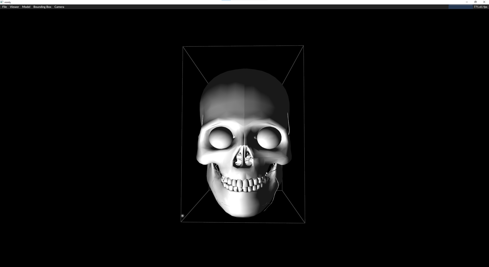
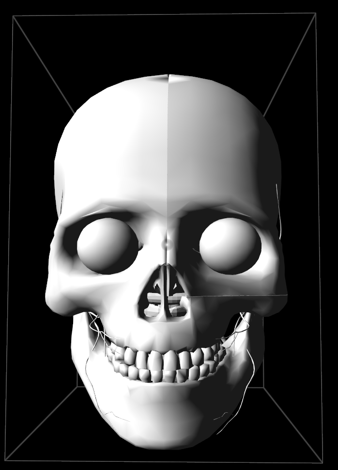

# Features implemented

 * Blinn-Phong illumination, with corresponding uniforms passed to shaders
 * Extended GUI to include, in models dropdown
   * Slider for shininess
     * The power the Blinn Phong value is raised to
   * Sliders for light intensity
     * For front(key)
     * Side(fill)
     * Back
   * Slider for light color
   * Checkbox for cel shading
   * Slider for how many levels of cel shading
     * Meaning how many parts the shading would be divided into
   * Cel Shading
   * 3 point lighting
 
# Where to find it
   * ModelRenderer.cpp:
     * 81-87 Init of new variables to be sent to shaders
     * 95-101 GUI features
     * 134-140 set uniforms for shader
   * model-base-fs.glsl
     * getAmbientColor() -> Returns ambient lighting for fragment
     * getDiffuse() -> Returns Diffuse lighting
     * getBlinnPhong() -> does Blinn Phong illumination
     * getCelShading() -> returns a float between 0.0 - 1.0 for cel shading
     * getShading() -> Does the shading combined, not including Blinn Phong
     * main() -> combines key, fill and backlight, and cel shading if necessary

# Models

* added a ball, which was slightly uneven

# Results

## Skull model only Blinn Phong front(key) light  

## Skull model only Blinn Phong only fill light 

## Skull model only Blinn Phong only back light 

## Skull model three point light 

## Skull model key light pink 

## Skull model top light 

## Cel shading on ball pink 

## Cel shading on side ball pink 

## GUI
